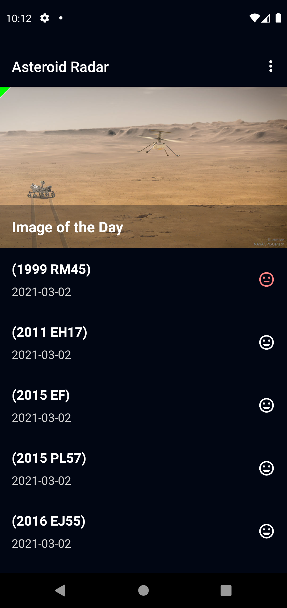
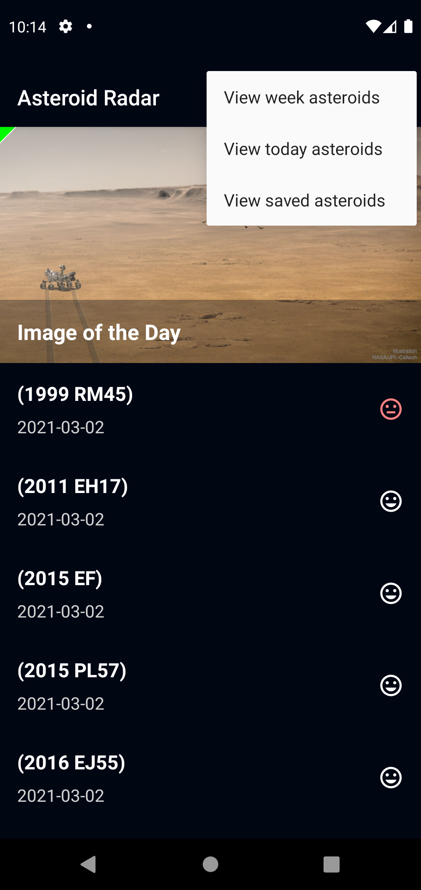
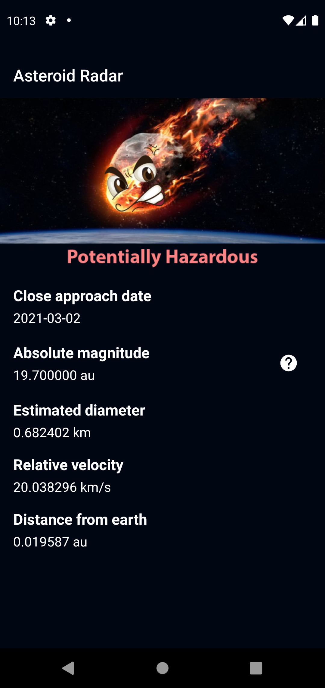
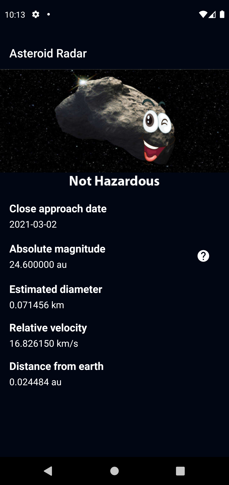
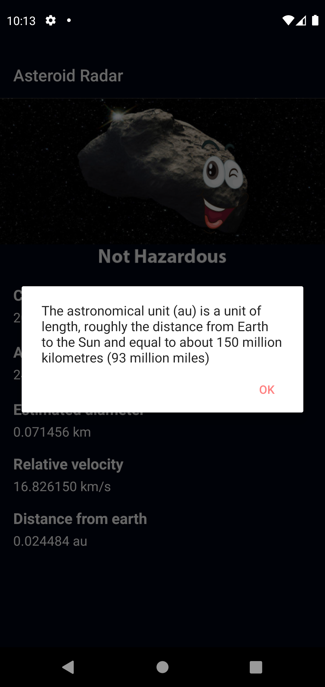

Asteroid Radar is a mobile application which shows the asteroids detected by NASA that pass near Earth. You can view all the detected asteroids in a period of time, explore their data (size, velocity, distance to Earth) and if they are potentially hazardous. The application uses data provided by NASA NeoWS (Near Earth Object Web Service) API.

I developed this application as part to of the Udacity's Android Kotlin Developer Nanodegree Program.

I built the app using the MVVM (Model-View-ViewModel) architecture pattern (to allow fast reaction to design changes) and the Repository Pattern (to hide the complexity of managing the interactions between the database and the networking code).
Asteroid Radar is also built with accessibility in mind: it provides descriptions for all the texts, images and buttons in talk back mode.

Key dependencies:

Retrofit - to download the data from the Internet.
Moshi - to convert the JSON data we are downloading to usable data in form of custom classes.
Picasso library - to download and cache images
RecyclerView - to display the asteroids in a list.

The app leverages the following components from the Jetpack library:

ViewModel
LiveData
Data Binding
Navigation
Room - for offline caching to allow users to interact with the app while offline (the app uses a WorkManager with requirements of internet connection and device plugged in to download asteroids periodically; the same WorkManager is used once a day to delete from the database the asteroids from the previous day)

## Setting up the Repository

To get started with this project, simply pull the repository and import the project into Android Studio. From there, deploy the project to an emulator or device. 

* NOTE: This project needs an API Key from NASA, which you can get from [NASA API portal](https://api.nasa.gov/). Add the API key to the local.properties like this:
properties
NASA_API_KEY=YOUR_NASA_API_KEY

## Application main flow
Take a look at the things you can do with this app:

